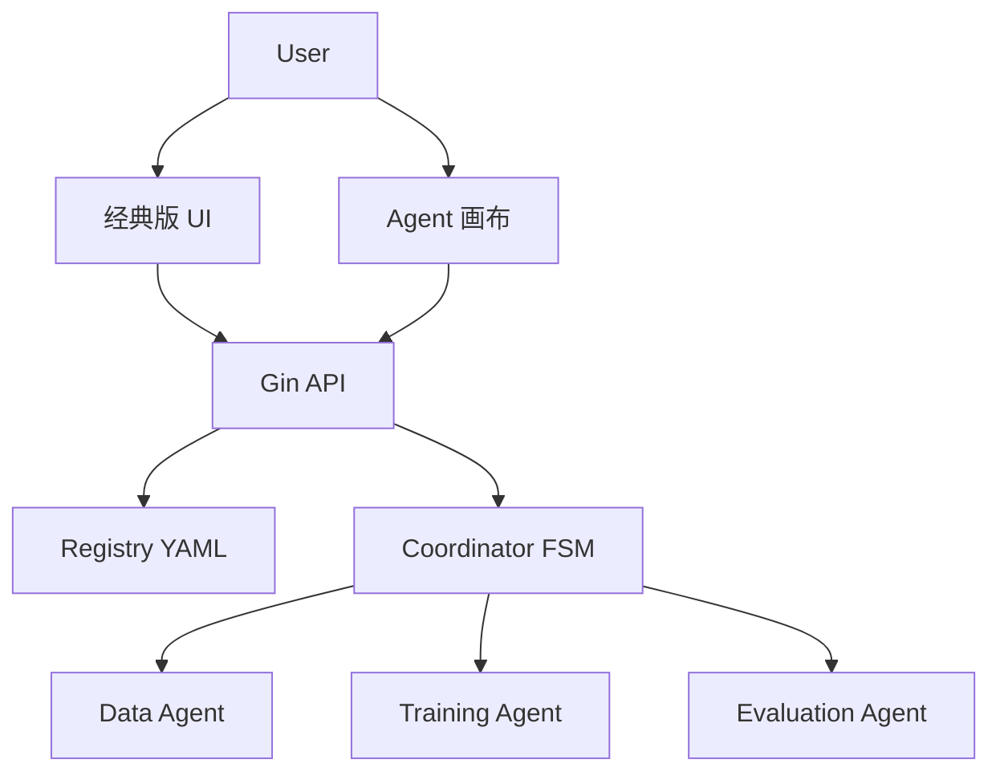
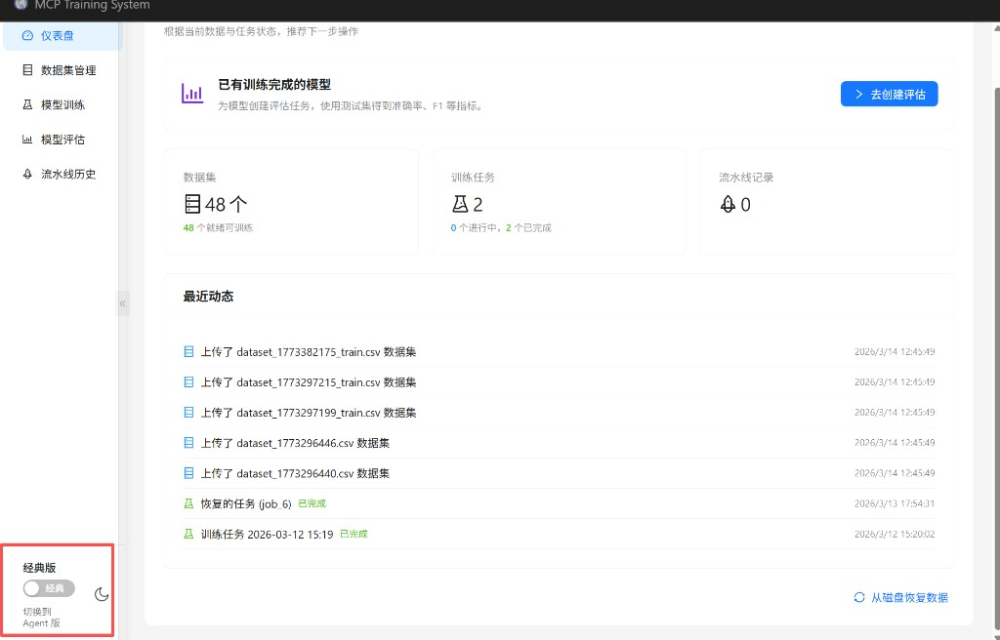
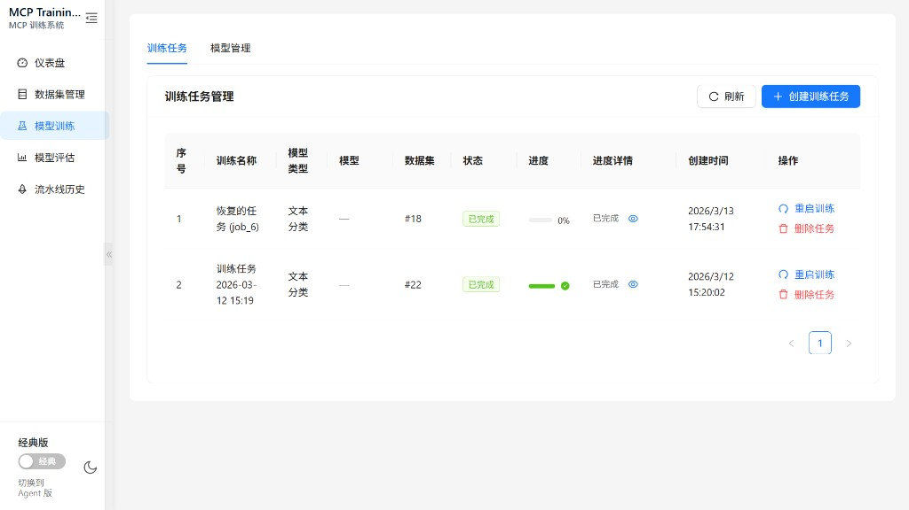
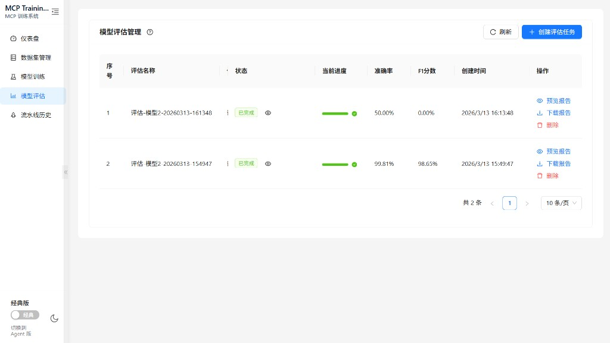

# MCP Training System

> 基于 MCP 的多模型协同训练平台：支持经典版「逐步管理」，也支持 Agent 版「一键流水线（清洗→训练→评估）」。

## 在线演示（GitHub Pages）

项目主页：<https://brocademaple.github.io/mcp_training-system/>

> 若你还没开启 Pages：把 **GitHub Pages 源**设置为 `docs/`（本项目已提供 `docs/index.html`）。

## 产品亮点

- **Agent 版一键流水线**：Coordinator 自动编排 Data Agent / Training Agent / Evaluation Agent，并落库 `pipeline_instances` 以便追溯。
- **经典版工作台**：仪表盘/数据集/训练/评估互通，适合逐步操作与可控排错。
- **训练与评估闭环**：训练任务进度、日志、评估指标、报告预览/下载贯穿全流程。
- **双版本数据互通**：同一套 PostgreSQL / Redis，Agent 与经典版生成的结果可互相查看。
- **可扩展的模型训练**：支持分类头训练与 SFT/LoRA/QLoRA/DPO 等（`model_type` 与 **RunSpec** 双轨兼容）。
- **三层解耦（语义任务 / 训练方法 / 领域）**：注册表见仓库根目录 `task_registry/`、`method_registry/`、`domain_registry/`；API `GET /api/v1/registry` 供前端加载；训练任务可写 `run_spec` JSON（见 `examples/`）。
- **Agent 意图识别（规则引擎）**：一句话描述经 `intent_registry/intent_patterns.yaml` 匹配默认任务类型与领域；扩展规则见 `docs/SPEC_CODING.md`「四之一」一节。

## 系统设计概要（调用流）



## 产品截图

把截图文件放到 `docs/images/`，并按下列文件名命名（本仓库已创建占位目录）。页面会自动展示：

- 图1：`docs/images/01-workflow.png`
- 图2：`docs/images/02-datasets.png`
- 图3：`docs/images/03-training-jobs.png`
- 图4：`docs/images/04-evaluation.png`
- 图5：`docs/images/05-agent-canvas.png`
- 图6：`docs/images/06-data-agent-plan.png`

说明：当前仓库用于展示的截图文件是占位图片链接；你把实际截图加入 `docs/images/` 后即可生效。

<div align="center">
  
  
  
</div>

## 技术栈

- **后端**: Go 1.21+ (Gin框架)
- **前端**: React 18 + TypeScript + Ant Design 5
- **数据库**: PostgreSQL 14, Redis 7
- **AI框架**: Python 3.8+, PyTorch, Transformers
- **模型**: BERT (文本分类)

## 文档索引

规范、协作方式与全项目文档导航见 **[docs/SPEC_CODING.md](docs/SPEC_CODING.md)**（推荐 AI 协作者与人类开发者从此入口查阅 PRD、API、部署与 2.0 规划等）。  
> 说明：`docs/LEARNING.md` 为**本地学习笔记**（默认不入库）；你可自行创建并维护。

## 快速开始（推荐：本机运行，训练使用本机 GPU）

本机运行后端与 Python 脚本，**训练可使用本机显卡（如 RTX 3060/4060）**；Docker 只用来跑 PostgreSQL 和 Redis。  
数据库补跑迁移（006～013 等）请直接对照目录 **`internal/database/migrations/`**（按文件名顺序执行）；也可参考 `docs/DEPLOYMENT.md`。

**示例 RunSpec 与样例数据**：[`examples/README.md`](examples/README.md)。

### 操作步骤与命令行（按顺序执行）

以下均在 **项目根目录** 执行（除步骤 6 在 `frontend` 目录）。

**步骤 1：启动数据库（Docker 只起 postgres + redis）**

```bash
docker-compose up -d postgres redis
```

**步骤 2：首次运行必须初始化数据库**

（本系统为个人工具，无用户管理，仅需建表。若已初始化过可跳过。PowerShell 若 `<` 报错见下方备选。）

```bash
docker exec -i postgres-mcp-training psql -U mcp_user -d mcp_training < internal/database/migrations/001_init.sql
docker exec -i postgres-mcp-training psql -U mcp_user -d mcp_training < internal/database/migrations/003_add_job_name.sql
```

<details>
<summary>Windows PowerShell 备选（若上面命令报错）</summary>

```powershell
Get-Content internal/database/migrations/001_init.sql | docker exec -i postgres-mcp-training psql -U mcp_user -d mcp_training
Get-Content internal/database/migrations/003_add_job_name.sql | docker exec -i postgres-mcp-training psql -U mcp_user -d mcp_training
```
</details>

若数据库是**旧版**（曾有过 users 表），需先执行一次：  
`Get-Content internal/database/migrations/005_remove_users.sql | docker exec -i postgres-mcp-training psql -U mcp_user -d mcp_training`

**步骤 3：安装 Python 依赖（本机，用于数据清洗与训练，可使用 GPU）**

```bash
pip install -r python_scripts/requirements.txt
```

Windows 上若使用 `py -3`：

```bash
py -3 -m pip install -r python_scripts/requirements.txt
```

**步骤 4：配置环境变量**

```bash
cp .env.example .env
```

默认已按本机方式配置（如 `DB_PORT=5433` 对应 docker-compose 映射）。无需改即可用。

**步骤 5：启动后端**

```bash
go run cmd/server/main.go
```

看到 `Server starting on 0.0.0.0:8080` 即成功。

**步骤 6：启动前端（新开一个终端）**

```bash
cd frontend
npm i
npm run dev
```

浏览器打开 **http://localhost:3000**，即可使用。训练任务会由本机 Python 执行，若已安装 NVIDIA 驱动且 `nvidia-smi` 可用，将自动使用本机 GPU。

---

### 可选：Docker 一键运行（交付/无 GPU 环境）

后端与 Python 打包进镜像，宿主机无需安装 Go/Python，适合交付或没有显卡的环境（镜像内为 CPU 版 PyTorch）。

```bash
docker-compose up -d
# 首次：执行上面「步骤 2」的三条数据库初始化命令
cd frontend && npm i && npm run dev
```

---

### 1. 环境准备

**安装依赖**:
```bash
# Go依赖
go mod download

# Python依赖
pip install -r python_scripts/requirements.txt

# 前端依赖
cd frontend
npm install
cd ..
```

### 2. 启动数据库（本机运行方式只起 postgres + redis）

```bash
docker-compose up -d postgres redis
```

宿主机端口为 **5433**（容器内 5432），`.env` 中已默认 `DB_PORT=5433`。

### 3. 初始化数据库（首次必须执行，无用户管理仅建表）

**推荐（适用 Windows / 未装 psql）**：
```bash
docker exec -i postgres-mcp-training psql -U mcp_user -d mcp_training < internal/database/migrations/001_init.sql
docker exec -i postgres-mcp-training psql -U mcp_user -d mcp_training < internal/database/migrations/003_add_job_name.sql
```

**本机已安装 psql 时**（注意端口 5433）：
```bash
psql -h localhost -p 5433 -U mcp_user -d mcp_training -f internal/database/migrations/001_init.sql
psql -h localhost -p 5433 -U mcp_user -d mcp_training -f internal/database/migrations/003_add_job_name.sql
```
（密码见 `.env` 中 `DB_PASSWORD`）。若为旧库曾建过 users 表，需再执行一次 `005_remove_users.sql`。

### 4. 配置环境变量

```bash
cp .env.example .env
# 根据需要修改 .env 文件
```

### 5. 启动后端服务

```bash
go run cmd/server/main.go
```

后端服务将在 `http://localhost:8080` 启动

### 6. 启动前端服务

```bash
cd frontend
npm run dev
```

前端服务将在 `http://localhost:3000` 启动

现在可以通过浏览器访问 `http://localhost:3000` 使用Web界面

### 常见问题

- **Windows 报错 `Python was not found` / exit status 9009**  
  后端需要调用 Python 执行数据清洗等脚本。请从 [python.org](https://www.python.org/downloads/) 安装 Python 3.8+，安装时勾选「Add Python to PATH」。安装后终端执行 `py -3 --version` 能显示版本即可。若本机只有某一目录下的 `python.exe`，可在 `.env` 中设置 `PYTHON_PATH=C:\路径\python.exe`。

- **数据集导入/清洗报错 `ModuleNotFoundError: No module named 'pandas'`**  
  说明当前运行后端的 Python 环境未安装脚本依赖。在项目根目录执行：
  ```bash
  pip install -r python_scripts/requirements.txt
  ```
  或 Windows 上：`py -3 -m pip install -r python_scripts/requirements.txt`  
  安装完成后重启后端（`go run cmd/server/main.go`），再对报错的数据集点击「重试清洗」即可。

- **训练任务无法成功 / 一直失败**  
  请按 [训练任务成功运行指南](docs/TRAINING_SETUP.md) 操作：确认 Python 与依赖、数据集已清洗、CSV 含有 `text` 与 `label`/`labels` 列等。

## API 使用示例

### 上传数据集

```bash
curl -X POST http://localhost:8080/api/v1/datasets/upload \
  -F "file=@data.csv" \
  -F "name=测试数据集" \
  -F "type=text"
```

### 创建训练任务

```bash
curl -X POST http://localhost:8080/api/v1/training/jobs \
  -H "Content-Type: application/json" \
  -d '{
    "dataset_id": 1,
    "model_type": "text_classification",
    "hyperparams": {
      "learning_rate": 0.00002,
      "batch_size": 16,
      "epochs": 3
    }
  }'
```

### 查询训练状态

```bash
curl http://localhost:8080/api/v1/training/jobs/1
```

### 创建评估任务

```bash
curl -X POST http://localhost:8080/api/v1/evaluations \
  -H "Content-Type: application/json" \
  -d '{
    "model_id": 1,
    "test_dataset_id": 0
  }'
```

## 项目结构

```
mcp-training-system/
├── cmd/server/          # 主程序入口
├── internal/            # 内部包
│   ├── agents/         # Agent层（数据、训练、评估）
│   ├── config/         # 配置管理
│   ├── database/       # 数据库连接和迁移
│   ├── handlers/       # HTTP处理器
│   ├── middleware/     # 中间件
│   ├── models/         # 数据模型
│   └── utils/          # 工具函数
├── python_scripts/      # Python脚本
│   ├── data/           # 数据处理
│   ├── training/       # 模型训练
│   └── evaluation/     # 模型评估
├── frontend/           # 前端项目
│   ├── src/
│   │   ├── components/ # 公共组件
│   │   ├── pages/      # 页面组件
│   │   ├── services/   # API服务层
│   │   └── types/      # TypeScript类型定义
│   ├── package.json
│   └── vite.config.ts
└── docker-compose.yml   # Docker配置
```

## 功能特性

### 后端功能
- ✅ 数据集上传和自动清洗；支持从 URL 链接爬取/导入 CSV
- ✅ BERT文本分类模型训练
- ✅ 实时训练进度监控（WebSocket 推送 + Redis 发布订阅）
- ✅ 模型评估和指标计算（含混淆矩阵、ROC 曲线、HTML 报告及下载）
- ✅ 模型管理：模型列表、模型导出下载（.zip/.pth）
- ✅ 三个Agent通过MCP协议协作
- ✅ RESTful API接口

### 前端功能
- ✅ 现代化Web界面（React + TypeScript + Ant Design）
- ✅ 仪表盘：系统概览和统计信息
- ✅ 数据集管理：本地上传、从 URL 导入、查看、状态监控
- ✅ 训练任务管理：创建任务、配置超参数、进度监控
- ✅ 模型管理：模型列表、下载入口
- ✅ 模型评估：查看评估结果、详细指标及下载 HTML 报告
- ✅ 响应式设计，支持多种屏幕尺寸

### PRD 功能对照（均已实现）
| 功能 | 状态 |
|------|------|
| 模型列表 API `GET /models` | ✅ |
| 模型下载 `GET /models/:id/download` | ✅ |
| 训练日志 API `GET /training/jobs/:id/logs` | ✅ |
| WebSocket 实时进度 `ws://.../ws/training/:id` | ✅ |
| 评估 ROC 曲线生成与存储 | ✅ |
| 评估报告 HTML 及 `GET /reports/download/:id` | ✅ |
| 从 URL 爬取/导入数据集 `POST /datasets/from-url` | ✅ |
| 前端「模型管理」页（列表与下载） | ✅ |

## 使用指南

### 通过Web界面使用

1. **访问系统**
   - 打开浏览器访问 `http://localhost:3000`
   - 系统会显示仪表盘页面

2. **上传或导入数据集**
   - 点击左侧菜单"数据集管理"
   - **本地上传**：点击"上传数据集"，填写名称与类型，选择 CSV 文件（最大 100MB），点击"上传"
   - **从 URL 导入**：点击"从 URL 导入"，填写名称与 CSV 文件链接（http/https），系统会抓取并自动清洗

3. **创建训练任务**
   - 点击左侧菜单"训练任务"
   - 点击"创建训练任务"按钮
   - 选择已就绪的数据集
   - 选择模型类型（文本分类）
   - 配置超参数：
     - 学习率（推荐：0.00002）
     - 批次大小（推荐：16）
     - 训练轮数（推荐：3）
   - 点击"创建"开始训练

4. **监控训练进度**
   - 在训练任务列表中查看任务状态
   - 实时显示训练进度和当前epoch
   - 点击"刷新"按钮更新状态

5. **评估模型**
   - 点击左侧菜单"模型评估"
   - 点击"创建评估任务"按钮
   - 输入训练完成的模型ID
   - 可选：指定测试数据集ID（留空则自动分割）
   - 点击"创建"开始评估

6. **查看评估结果**
   - 在评估列表中点击"查看详情"
   - 查看准确率、精确率、召回率、F1分数等指标

## 交付与开箱即用

交付给他人（无 GPU 或不想装 Python）时，可使用 **Docker 一键运行**：`docker-compose up -d`，再执行上述「步骤 2」的三条数据库初始化命令，最后 `cd frontend && npm i && npm run dev`。后端与 Python 均在容器内，镜像为 CPU 版 PyTorch。

## 开发者

本项目严格按照PRD文档实现，包含完整的数据库设计、Agent架构、API接口和Web前端界面。

### 技术文档
- **文档总索引与协作约定**：`docs/SPEC_CODING.md`
- **本地学习笔记（可选，不入库）**：`docs/LEARNING.md`
- 详细API文档：`docs/API.md`
- 部署文档：`docs/DEPLOYMENT.md`
- 前端文档：`frontend/README.md`
- 产品需求文档：`PRD.md`

